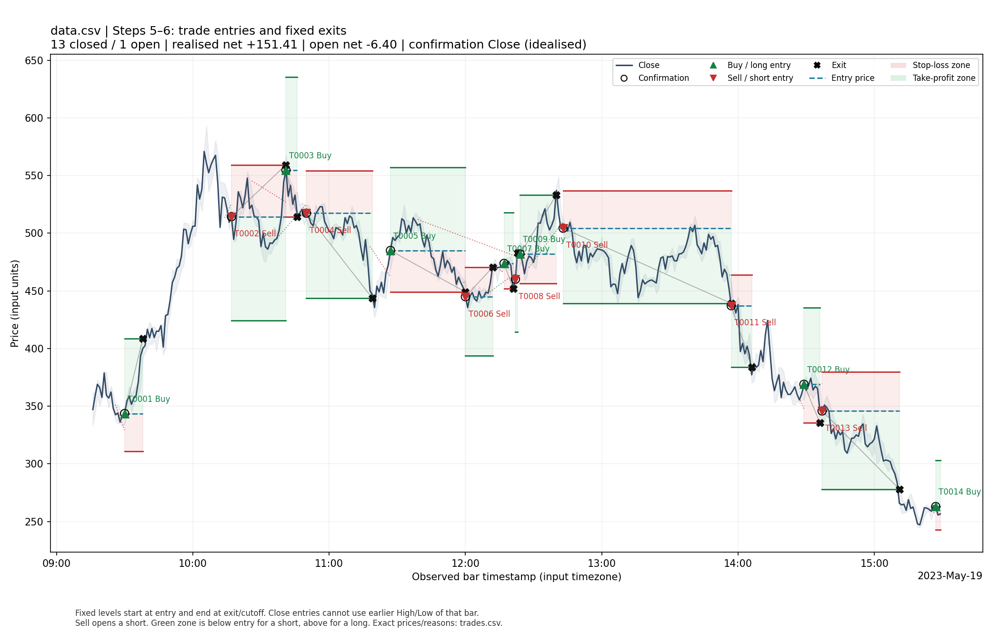
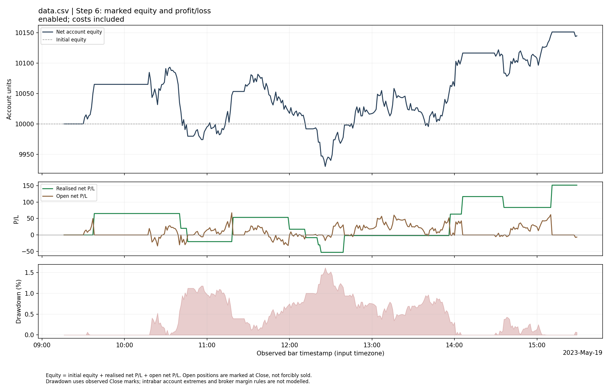

# Step 5–6 validation results — original data.csv

## Data and reproducibility

Executed on 7 October 2026 (UTC), using Python 3.12.14 and Matplotlib 3.10.8.
Input: `data/data.csv`, **374 one-minute bars**, 2023-05-19T09:16:00 to 2023-05-19T15:29:00.
Input SHA-256: `76fc3a3bfb9b48b6c8baa85b858a7a8cdfbbd8d07e8078865f0c9794af7d4d7e`. The source bytes are unchanged from the uploaded ZIP.
Volume is absent; VWAP remains unavailable as in the existing program.

```bash
python app.py data/data.csv --output output
python app.py data/data.csv --entry-timing next_open --output examples/step56_next_open
python run_methods.py data/data.csv --output examples/step56_methods
python -m unittest discover -s tests -v
```

## Pictured method, default traditional TA

TA window 2, Close basis; trend tolerance 0.5%; Step 4 requires 2 consecutive
qualifying closes and observes 5 following bars. Steps 1–4 yield 49 swing highs,
52 swing lows, 152 trendline candidates, 141 first-break events and 114 confirmed
line events. Several line events may describe the same price movement.

Default trading settings: confirmation-Close fills, long and short enabled,
ATR(14), stop distance 2 × ATR, target distance 2 × risk, quantity 1, starting
equity 10,000. Slippage, commission and borrow rate are zero; EMA filtering and
optional false/opposite exits are off. The following amounts are in input/account
units, not an assumed currency.

| Measure | Result |
| --- | ---: |
| Filled positions | 14 |
| Long / short | 7 / 7 |
| Closed / still open | 13 / 1 |
| Realised net P/L | +151.4090 |
| Open net P/L at cutoff | -6.4000 |
| Final marked equity | 10145.0090 |
| Closed-trade win rate | 46.1538% |
| Maximum marked drawdown | 1.6183% |
| Ambiguous stop/target bars | 0 |
| Pending entry orders | 0 |

There are 58 grouped confirmation decisions; 44 were skipped while a position was already open.
A line event is not an independent trade. The last open position is marked at the
last Close and excluded from realised P/L and win rate.





## Sensitivity to execution timing

Holding all other default attributes constant, next-Open execution produces
**16 closed and 1 open** positions,
realised net P/L **-263.3238**, open net P/L
**-0.9000**, and final equity **9735.7762**.

This is materially different from the pictured same-Close model. Entries have a
different fill price; Open entries also face that bar's later High/Low, whereas
Close entries cannot use earlier intrabar extremes. The changed exit history
then changes when the single position slot is free for the next signal. These
results show sensitivity to assumptions, not that either setting was optimized.
The next-Open files are in `examples/step56_next_open` in the full project ZIP.

## Four swing methods, identical trade settings

Each method supplies its own Step 1–2 swings, but uses the same Step 3–6 pipeline.
Only swing-method default settings differ below.

| Swing method | Closed | Open | Realised net P/L | Open net P/L | Final equity |
| --- | ---: | ---: | ---: | ---: | ---: |
| ta | 13 | 1 | +151.4090 | -6.4000 | 10145.0090 |
| percentage | 10 | 0 | +62.2618 | +0.0000 | 10062.2618 |
| atr | 9 | 0 | +104.7095 | +0.0000 | 10104.7095 |
| prominence | 11 | 0 | -60.1360 | +0.0000 | 9939.8640 |

The full project includes the per-method 20-file results and comparison table in
`examples/step56_methods`. The changes-only ZIP includes the implementation,
tests, documentation and default `output` results; optional comparison folders
are in the full project and can be regenerated with the commands above.

## Verification and limitations

**All 137 tests passed** (113 existing tests plus 24 new Step 5–6 tests).
The complete log is `STEP56_TEST_RESULTS.txt`. The new tests verify signed long/short
arithmetic, frozen ATR levels, cost accounting, capital checks, next-Open and
same-Close timing, stop gaps, target gaps, stop-first ambiguity, pending orders,
false-break timing, opposing/duplicate signals, open marking, CSV/JSON consistency
and input-file protection. Prefix tests cover four methods in both execution
modes: later data do not change earlier fills or equity marks. Existing Step 1–4
and indicator tests remain in the suite.

The trade/equity figures were rendered and inspected. Real GUI callback tests use
mock widgets with actual analysis; the environment has no graphical desktop for
an interactive Tk window check. Run `python app.py data/data.csv --gui` locally.

This single historical session verifies software behavior and arithmetic. It does
not establish out-of-sample profitability. Same-Close fills, zero execution costs
and absent liquidity/margin constraints are explicit modelling assumptions.
