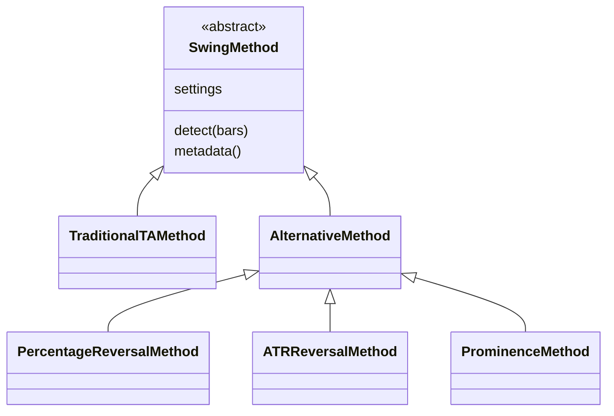

# Unified swing methods

One project now contains traditional TA and all three alternatives. The supplied
`full_project.zip` is the integration baseline; the alternative ZIP supplies the
existing algorithms and the unchanged TSLA dataset. The original `data/data.csv`
and `data/data.json` are retained. No external data was downloaded.

## Design

`SwingMethod` is the Strategy interface. Each concrete class implements `detect(bars)`.
`TraditionalTAMethod` adapts the original `detect_swings(bars, window, basis)` API.
`AlternativeMethod` adapts the old `detect_swings(bars, settings)` API, with three
concrete strategies identifying the settings type. A registry/factory constructs
the selected class. The shared pipeline calls the interface polymorphically.
This is Strategy with small adapters, rather than four independent applications.



`app.py`, `gui.py` and `run_methods.py` call the shared analysis in `pipeline.py`.
Data loading, the Bar model, candidate trendlines, chart drawing, indicator
calculation and export are each maintained in one place. Traditional SwingPoint
is the common event model; alternative events subclass it to add threshold,
ATR-at-pivot and prominence evidence. All events retain distinct pivot and
confirmation times. Old public detector imports and streaming update() remain valid.

## Method settings

| CLI name | Class | Default settings | Confirmation |
|---|---|---|---|
| ta | TraditionalTAMethod | window=2, basis=close | Strict extrema; wait two bars |
| percentage | PercentageReversalMethod | reversal_percent=5 | Opposite Close move reaches 5% of running extreme |
| atr | ATRReversalMethod | atr_period=14, atr_multiplier=2 | Opposite move reaches 2 × ATR frozen at extreme |
| prominence | ProminenceMethod | radius=5, min_prominence_percent=3, min_distance=3 | Completed bounded context, prominence cutoff, past-only spacing |

Only traditional TA supports `high-low`; alternatives keep their original
Close-only definition. Reversal delay is variable, so its chart has no fixed
right-edge window shading. Prominence uses bounded local context, not an
unrestricted whole-history peak search. No final unconfirmed extreme is forced.
The legacy ATR reversal arithmetic is deliberately preserved; it uses the same
Wilder definition as the indicator but retains its original floating-point
operation order for exact regression reproducibility.

All methods feed the same `trendlines.py` candidate construction and validation:
join rising lows for support and falling highs for resistance; reject pairs
already breached by second-anchor confirmation; stop at first later breach;
count confirmed touches and rank the display subset. The original and alternative
ZIPs already contained identical copies of this trendline module. It is kept
once, unchanged. The slope uses elapsed minutes, including gaps.

## Run in a terminal

Open a terminal in this folder (the one containing `app.py`). Activate a working
Python environment and install `requirements.txt` if necessary. Python 3.10+
is required. Use the same Python interpreter that successfully runs Tkinter.

```bash
python app.py data/data.csv
python app.py data/TSLA_ready.csv --method ta --window 2 --output results/ta
python app.py data/TSLA_ready.csv --method percentage --reversal-percent 5 --output results/percentage
python app.py data/TSLA_ready.csv --method atr --swing-atr-period 14 --atr-multiplier 2 --output results/atr
python app.py data/TSLA_ready.csv --method prominence --radius 5 --min-prominence-percent 3 --min-distance 3 --output results/prominence
```

The default method is TA, so previous commands continue to work. Inapplicable
method flags are rejected instead of silently ignored. `--atr-period` adjusts
the ATR **indicator**, whereas `--swing-atr-period` adjusts the ATR **swing detector**.
All eight indicators remain available with all four swing methods. Original
data.csv has no volume, so VWAP stays unavailable; no volume is fabricated.

## GUI

```bash
python app.py data/TSLA_ready.csv --gui
```

Select `ta`, `percentage`, `atr` or `prominence` in **Swing method**. Click
**Method settings** to edit that method's parameters, then apply. **Apply / replay**
uses the current selected method on the observed prefix. Traditional window/basis
controls are disabled for the alternatives. **Indicator settings** and
**Indicator chart** continue to work. **Export visible results** exports the last
successfully applied snapshot, even if controls have since been edited.

On your Mac, if the environment is the one created in your home directory:

```bash
source ~/.venv-gui/bin/activate
```

Then type `cd ` with a trailing space, drag this project folder into the terminal,
and press Enter before running the GUI command. `python -m tkinter` is the small
Tk test window; `app.py --gui` starts this application. Do not pip-install tkinter.

## Use classes directly

```python
from swingpoints.data import load_prices
from swingpoints.methods import (
    METHODS, create_method, PercentageSettings, PercentageReversalMethod,
)
from swingpoints.pipeline import analyze

bars = load_prices("data/TSLA_ready.csv")
method = PercentageReversalMethod(PercentageSettings(reversal_percent=3))
result = analyze(bars, method)
print(len(result.points), len(result.lines))

for name in METHODS:
    result = analyze(bars, create_method(name))
    print(name, len(result.points))
```

Parameters are validated frozen dataclass attributes. Construct another settings
object (or use `dataclasses.replace`) to change them. A new method should subclass
SwingMethod, return compatible confirmed events and register in METHODS. The
pipeline itself requires no method-specific branch; CLI flags must also be exposed
if the new method needs command-line parameters. GUI settings derive from dataclass
fields. Replay recalculates the prefix; the batch adapter is not an incremental
streaming implementation for the three alternatives.

## Compare methods and parameters

```bash
python run_methods.py data/TSLA_ready.csv --output results/comparison
python run_methods.py data/TSLA_ready.csv --sweep --output results/sweep
python run_methods.py data/TSLA_ready.csv --grid method_grid.json --output results/custom
```

First command runs four defaults; `--sweep` runs 12 default parameter combinations;
`method_grid.json` illustrates eight combinations. Change `ExperimentSettings`
class attributes in `run_methods.py` or provide your own JSON. Add `--until 100`
for a prefix, or `--methods ta percentage` for a subset (a supplied JSON must not
contain excluded methods). Each run has its own output folder. comparison.csv/json
record parameters and counts; comparison.png compares swing counts and delays.
Use a fresh output directory for a new experiment to avoid mixing older run folders.

Each run writes nine files: prices.png (Steps 1–3 together), swing_points.csv/json,
trendlines.csv/json, indicators.csv/json/png and run_summary.json. Alternative
swing tables add method/threshold/prominence/ATR evidence columns; TA swing columns
remain unchanged. Summary includes the applied method, parameters and timing rule.
`window` is null for variable-delay reversal methods. The old standalone projects'
separate step1/step2 PNG files are replaced by the common combined prices.png.

## Supplied results and tests

`examples/unified_tsla/` contains four completed default runs on the full 639-row
TSLA file. These are result folders only; no duplicate application code is inside.

| Method | Highs | Lows | Total swings | Trend candidates | Mean delay (bars) |
|---|---:|---:|---:|---:|---:|
| Traditional TA | 91 | 81 | 172 | 263 | 2.000 |
| Percentage reversal | 43 | 42 | 85 | 107 | 2.341 |
| ATR reversal | 16 | 16 | 32 | 35 | 4.938 |
| Local prominence | 61 | 63 | 124 | 101 | 5.000 |

All four defaults display six ranked lines (three per direction). Counts compare
these parameter choices and do not establish predictive accuracy or superiority.
The original 374-row data.csv default remains 49 highs, 52 lows, 152 candidates.
`output/` contains that regenerated default run.

```bash
python -m unittest discover -s tests -v
```

95 tests passed. The 59 existing TA/indicator tests were retained (GUI fixtures
updated for the strategy selector); 25 alternative hand-calculation/causality
tests and 11 integration tests were added. Fourteen settings/data combinations
match canonical swing and trendline records produced by the untouched ZIP code.
The legacy reference hashes and their purpose are in tests/fixtures/legacy_results.json.
All eight pre-existing output files other than the expanded summary match a fresh
original-code run byte for byte; all original summary fields retain their values.
GUI refresh/export callbacks are tested with mock widgets; a real macOS window
has not been manually exercised in this execution environment.
